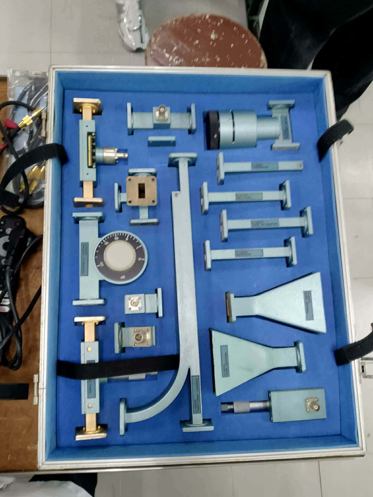
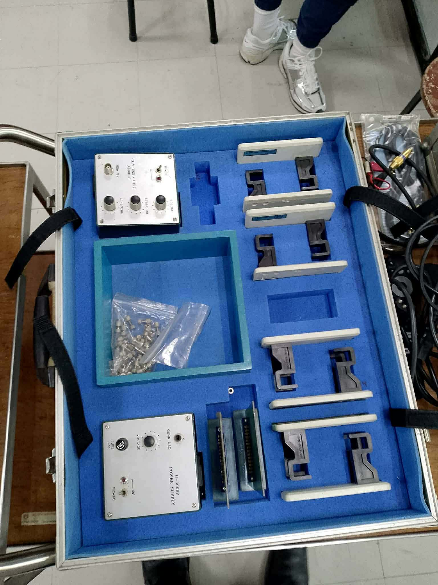

# Waveguide Systems Laboratory Activity

This laboratory activity demonstrates **signal transmission using waveguides**. Students will set up a **waveguide transmission-reception module**, observe signal propagation, and measure amplitude, phase, and reflections.  

---

## Objective

- Understand how waveguides transmit electromagnetic waves with minimal loss.  
- Observe the effect of waveguide dimensions, orientation, and material on signal strength.  
- Learn to measure waveguide performance using an oscilloscope.  
- Identify the function and specialty of each waveguide component.  

---
**Waveguide Parts**  

## Waveguide Parts and Their Functions

1. **Waveguide Body (Main Conductor)**  
   - Guides the electromagnetic wave along a specific path.  
   - Usually made of metal (copper or aluminum) for low loss.  
   - Specialty: Minimizes energy loss and prevents radiation leakage.  

2. **Waveguide Flanges**  
   - Flat surfaces at waveguide ends for connecting sections.  
   - Provide precise alignment and mechanical stability.  
   - Specialty: Ensures minimal signal reflection at joints.  

3. **Coupling Port / Probe**  
   - Introduces or extracts the signal from the waveguide.  
   - Can be **coax-to-waveguide adapters** for testing with lab equipment.  
   - Specialty: Allows measurement and interfacing with instruments like oscilloscopes or power meters.  

4. **Tuning Screws / Slugs**  
   - Adjustable components inside some waveguides.  
   - Used to fine-tune impedance or remove reflections.  
   - Specialty: Reduces standing waves and VSWR for optimal transmission.  

5. **Bends / Twists**  
   - Sections of the waveguide can be bent to fit physical layouts.  
   - Specialty: Must maintain a curvature above a minimum radius to prevent signal loss.  

6. **Terminations / Loads**  
   - Absorbing elements placed at the end of unused waveguides.  
   - Specialty: Prevents reflections and standing waves from interfering with measurements.  

7. **Directional Couplers / Power Splitters**  
   - Diverts a portion of the wave for measurement or monitoring.  
   - Specialty: Allows simultaneous signal observation without affecting main transmission.  

8. **Adapters**  
   - Converts rectangular, circular, or coaxial inputs to a compatible waveguide format.  
   - Specialty: Interfaces lab instruments with waveguides of different shapes and sizes.  

---

## Procedure

### Step 1 – Setting Up the Waveguide Transmission Module

1. Connect the **signal source** to the **waveguide input port** using a coax-to-waveguide adapter.  
2. Set the **frequency** of the signal generator to match the waveguide’s operational band.  
3. Ensure proper **alignment** of waveguide sections to minimize reflections.  
4. Observe the signal at the **waveguide output port** with the oscilloscope.  

**Waveguide Setup Illustration:**  
``  

---

### Step 2 – Setting Up the Reception Module

1. Connect the **receiving waveguide port** to the oscilloscope.  
2. Adjust vertical scale and coupling to properly view the received signal.  
3. Observe amplitude, phase, and any distortions on the waveform.  

---

### Step 3 – Observing Waveguide Behavior

1. Rotate or slightly adjust the **waveguide sections** and observe changes in transmitted signal.  
2. Measure **attenuation** and **signal reflections** using the oscilloscope.  
3. Record points of **maximum signal strength** and locations of **standing waves**.  

---

### Step 4 – Testing Different Waveguide Types

1. Repeat Steps 1–3 using different **waveguide types**:  
   - Rectangular Waveguide  
   - Circular Waveguide  
   - Twisted / Bent Waveguides  
   - Coaxial-to-Waveguide Adapters  
2. Observe how **dimension, shape, and material** affect signal transmission.  
3. Record amplitude, phase shift, and reflections in a table.  

---

### Step 5 – Signal Measurement and Analysis

1. Measure **peak-to-peak voltage (Vpp)** on the oscilloscope.  
2. Measure **frequency** and **period** of the received waveform.  
3. Compare measured amplitude for each waveguide type and orientation.  

**Formulas:**  

**Peak-to-Peak Voltage:**  
Vpp = number of vertical divisions × V/div setting

**Frequency:**  
f = 1 / T

Where `T` is the measured period of the waveform.  

---

### Step 6 – Optional: Reflections and Standing Waves

1. Introduce a **mismatch** or partially block the waveguide and observe reflections.  
2. Measure **VSWR (Voltage Standing Wave Ratio)** along the waveguide.  
3. Record locations of **nodes** and **antinodes**.  

---

## Discussion Points

- How does waveguide **dimension and orientation** affect signal strength and losses?  
- What effect do **bends, twists, or material imperfections** have on signal transmission?  
- How do waveguides compare to **antenna transmission** in terms of efficiency and directivity?  
- Why are **adapters, couplers, and terminations** critical for laboratory measurements?  

---

## Examples of Waveguide Types

- Rectangular Waveguide  
- Circular Waveguide  
- Twisted / Bent Waveguide  
- Coaxial-to-Waveguide Adapter  

## Conclusion

Waveguides are critical components in microwave and RF systems, providing a **controlled path for electromagnetic wave propagation** with minimal loss. Correct alignment, proper sectioning, and use of adapters and terminations are essential to reduce reflections, standing waves, and signal distortion. The activity demonstrates that **waveguide shape, material, and orientation directly influence signal transmission efficiency**.  

---

## Learnings

- Waveguides effectively **guide high-frequency signals** with low radiation losses compared to open-air transmission.  
- Proper use of **couplers, terminations, and tuning elements** ensures stable and measurable signals.  
- Observing signal **attenuation, phase shift, and reflections** helps understand the physics behind standing waves and VSWR.  
- Testing different **waveguide types and orientations** provides insight into how structural and material differences affect signal quality.  
- Hands-on experience reinforces **concepts of controlled electromagnetic wave propagation**, which are essential in radar, satellite communications, and microwave engineering.
